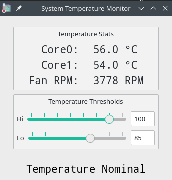

# CPU Temperature Monitor



## Background Info
My Lenovo T430 laptop heats up **alot** to the point where it shuts down without warning. Alot means 105 °C.
It doesn't always heat up that much, but when it does, it does so without warning, and I have lost data
because of it.

It heats up because it is connected to 3 monitors via a docking station which obstructs much of the cooling
ports. Silly design if you ask me, but alas laptops also were not designed to be used as desktops the way
I am using it.

## What this does
This applet reads my CPU temperatures every 2 seconds, and displays them. If the largest of the two
temperatures exceeds a "High" temperature threshold, it blares a siren and generates a desktop
notification.

The siren stops when the highest of the two core temperatures drops below a "Low" temperature threshold.

## Cool! How to install it?
This was a silly project I made to familiarize myself with PyQt so don't expect this to work if you
don't have a non-linux laptop that isn't a Lenovo T430. But be my guest and try it, and tell me if it
works :)

To use this, make sure you have `python3` installed, as well as `pip` (use your
package manager to obtain these if you don't have them).

Clone this repository, `cd` into it, and run the following commands (without the '$'):
```
$ python -m venv _venv  # This is only required ONCE
$ . _venv/bin/activate
$ pip install -r requirements.txt
```

This will create a python virtual environment, and install all necessary packages
using the `requirements.txt` file.

If you close your terminal window and want to resume work on this project, reactivate
the virtual environment as follows:
```
$ . _venv/bin/activate
```

To run the project, do:
```
$ python main.py
```

## Why this is useful
My computer doesn't always heat up obnoxiously to the point where it shuts down. It usually does so
if I'm gaming, or if I'm doing heavy media rendering like using CAD software or watching cat videos
during ~boring zoom meetings~ online classes.

When the siren activates, I use my can of compressed air to rapidly cool down my computer to a nominal
level. Is it the smartest solution? Probably not. But using a laptop cooler and keeping the laptop lid
open all the time actually isn't as helpful as one would expect, and I *need* my laptop to work as a desktop
because I also need it to work as a laptop when I go to school. So this is currently the best solution
¯\\\_(ツ)\_/¯

## F.A.Q.

### 105 Degrees?! That's alot!
True. It might not be that much. I haven't actually measured it yet. I do know two facts:

1. 105 degrees is what the `sensors` command lists as my CPU's "critical" temperature.
   Thus I assume that is the point where it automatically shuts down with no warning
2. When I'm gaming, I easily record temperatures of 95 degrees. It's wild.

### Why don't you keep the laptop lid open?
I do.

### Laptop Cooler?
Check.

### Maybe your fan has lint and s**t stuck in there that you can clean out.
My fan is clean. I opened my laptop up and blew compressed air at it. I wish
this was the problem.

### You could make a liquid cooling system?
That's alot of effort and I'm not feeling it. Also I might get a new laptop soon that heats less or has
a better docking station that allows for better ventilation.

### This is a nonsense F.A.Q.
I know. I was bored when I wrote it. I should be doing physics homework right now.
